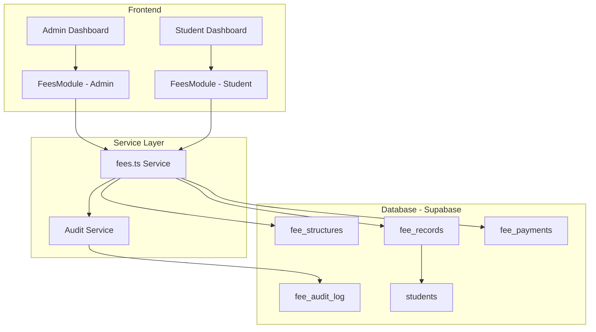
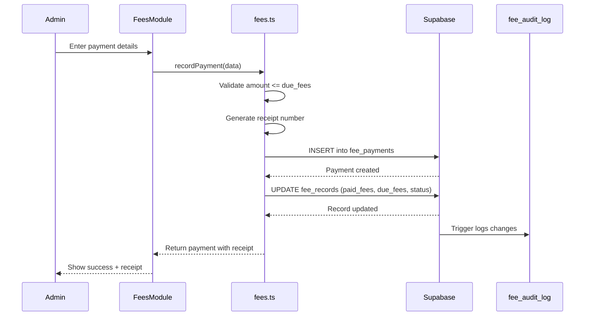

# Design Document: Fees Management System

## Overview

The Fees Management System is a comprehensive module for Sarvodaya College that enables administrators to manage student fees, record cash payments, and track financial data with complete audit trails. The system integrates with the existing admin dashboard and student portal, leveraging Supabase for data storage with Row Level Security (RLS) for access control.

The design follows the existing patterns in the codebase:
- Supabase service files for database operations
- Admin dashboard modules for management UI
- Student dashboard modules for viewing
- Database triggers for audit logging
- TypeScript interfaces for type safety

## Architecture



## Components and Interfaces

### Database Tables

#### fee_structures
Stores fee templates that can be applied to students.

```sql
CREATE TABLE fee_structures (
  id UUID PRIMARY KEY DEFAULT gen_random_uuid(),
  name TEXT NOT NULL,
  academic_year TEXT NOT NULL,
  applicable_class TEXT NOT NULL,
  tuition_fee NUMERIC(10,2) DEFAULT 0,
  lab_fee NUMERIC(10,2) DEFAULT 0,
  library_fee NUMERIC(10,2) DEFAULT 0,
  sports_fee NUMERIC(10,2) DEFAULT 0,
  exam_fee NUMERIC(10,2) DEFAULT 0,
  other_fee NUMERIC(10,2) DEFAULT 0,
  total_fee NUMERIC(10,2) NOT NULL,
  is_active BOOLEAN DEFAULT true,
  created_by UUID NOT NULL,
  created_at TIMESTAMPTZ DEFAULT NOW(),
  updated_at TIMESTAMPTZ DEFAULT NOW()
);
```

#### fee_records
Stores individual student fee assignments.

```sql
CREATE TABLE fee_records (
  id UUID PRIMARY KEY DEFAULT gen_random_uuid(),
  student_id UUID NOT NULL REFERENCES students(id),
  fee_structure_id UUID REFERENCES fee_structures(id),
  academic_year TEXT NOT NULL,
  total_fees NUMERIC(10,2) NOT NULL,
  paid_fees NUMERIC(10,2) DEFAULT 0,
  due_fees NUMERIC(10,2) NOT NULL,
  due_date DATE NOT NULL,
  fee_status TEXT DEFAULT 'Pending' CHECK (fee_status IN ('Paid', 'Partial', 'Pending', 'Overdue')),
  tuition_fee NUMERIC(10,2) DEFAULT 0,
  lab_fee NUMERIC(10,2) DEFAULT 0,
  library_fee NUMERIC(10,2) DEFAULT 0,
  sports_fee NUMERIC(10,2) DEFAULT 0,
  exam_fee NUMERIC(10,2) DEFAULT 0,
  other_fee NUMERIC(10,2) DEFAULT 0,
  notes TEXT,
  created_by UUID NOT NULL,
  created_at TIMESTAMPTZ DEFAULT NOW(),
  updated_at TIMESTAMPTZ DEFAULT NOW()
);
```

#### fee_payments
Stores individual payment transactions.

```sql
CREATE TABLE fee_payments (
  id UUID PRIMARY KEY DEFAULT gen_random_uuid(),
  fee_record_id UUID NOT NULL REFERENCES fee_records(id),
  student_id UUID NOT NULL REFERENCES students(id),
  amount NUMERIC(10,2) NOT NULL CHECK (amount > 0),
  payment_date DATE NOT NULL DEFAULT CURRENT_DATE,
  payment_method TEXT DEFAULT 'cash' CHECK (payment_method IN ('cash')),
  receipt_number TEXT UNIQUE NOT NULL,
  notes TEXT,
  recorded_by UUID NOT NULL,
  created_at TIMESTAMPTZ DEFAULT NOW()
);
```

#### fee_audit_log
Immutable audit trail for all fee operations.

```sql
CREATE TABLE fee_audit_log (
  id UUID PRIMARY KEY DEFAULT gen_random_uuid(),
  table_name TEXT NOT NULL,
  record_id UUID NOT NULL,
  action TEXT NOT NULL CHECK (action IN ('INSERT', 'UPDATE', 'DELETE')),
  old_data JSONB,
  new_data JSONB,
  changed_by UUID NOT NULL,
  changed_at TIMESTAMPTZ DEFAULT NOW(),
  description TEXT
);
```

### TypeScript Interfaces

```typescript
// Fee Structure
interface FeeStructure {
  id: string;
  name: string;
  academic_year: string;
  applicable_class: string;
  tuition_fee: number;
  lab_fee: number;
  library_fee: number;
  sports_fee: number;
  exam_fee: number;
  other_fee: number;
  total_fee: number;
  is_active: boolean;
  created_by: string;
  created_at: string;
  updated_at: string;
}

// Fee Record (Student's fee assignment)
interface FeeRecord {
  id: string;
  student_id: string;
  fee_structure_id: string | null;
  academic_year: string;
  total_fees: number;
  paid_fees: number;
  due_fees: number;
  due_date: string;
  fee_status: 'Paid' | 'Partial' | 'Pending' | 'Overdue';
  tuition_fee: number;
  lab_fee: number;
  library_fee: number;
  sports_fee: number;
  exam_fee: number;
  other_fee: number;
  notes: string | null;
  created_by: string;
  created_at: string;
  updated_at: string;
  // Joined data
  student?: Student;
}

// Payment
interface FeePayment {
  id: string;
  fee_record_id: string;
  student_id: string;
  amount: number;
  payment_date: string;
  payment_method: 'cash';
  receipt_number: string;
  notes: string | null;
  recorded_by: string;
  created_at: string;
  // Joined data
  student?: Student;
  recorded_by_user?: { email: string };
}

// Audit Log Entry
interface FeeAuditLog {
  id: string;
  table_name: string;
  record_id: string;
  action: 'INSERT' | 'UPDATE' | 'DELETE';
  old_data: Record<string, unknown> | null;
  new_data: Record<string, unknown> | null;
  changed_by: string;
  changed_at: string;
  description: string | null;
  // Joined data
  admin_user?: { email: string };
}

// Dashboard Statistics
interface FeeStatistics {
  totalExpected: number;
  totalCollectedThisMonth: number;
  totalOutstanding: number;
  overdueStudentCount: number;
  recentPayments: FeePayment[];
  topDefaulters: FeeRecord[];
  monthlyTrend: { month: string; amount: number }[];
}
```

### Service Functions

```typescript
// Fee Structure Operations
createFeeStructure(data: Omit<FeeStructure, 'id' | 'created_at' | 'updated_at'>): Promise<Result<FeeStructure>>
updateFeeStructure(id: string, data: Partial<FeeStructure>): Promise<Result<FeeStructure>>
deleteFeeStructure(id: string): Promise<Result<void>>
getFeeStructures(filters?: { academic_year?: string; class?: string }): Promise<Result<FeeStructure[]>>
getFeeStructureById(id: string): Promise<Result<FeeStructure>>

// Fee Record Operations
assignFeeToStudent(studentId: string, data: FeeAssignmentData): Promise<Result<FeeRecord>>
updateFeeRecord(id: string, data: Partial<FeeRecord>): Promise<Result<FeeRecord>>
getFeeRecordByStudent(studentId: string, academicYear?: string): Promise<Result<FeeRecord>>
getFeeRecords(filters?: FeeRecordFilters): Promise<Result<FeeRecord[]>>
getOverdueRecords(): Promise<Result<FeeRecord[]>>

// Payment Operations
recordPayment(data: PaymentData): Promise<Result<FeePayment>>
getPaymentsByStudent(studentId: string): Promise<Result<FeePayment[]>>
getPaymentsByDateRange(startDate: string, endDate: string): Promise<Result<FeePayment[]>>
generateReceiptNumber(): string

// Statistics
getFeeStatistics(academicYear: string): Promise<Result<FeeStatistics>>
getCollectionReport(filters: ReportFilters): Promise<Result<CollectionReport>>
getDefaultersReport(filters: ReportFilters): Promise<Result<DefaultersReport>>
getClassWiseReport(academicYear: string): Promise<Result<ClassWiseReport>>

// Audit Log
getFeeAuditLogs(filters?: AuditLogFilters): Promise<Result<FeeAuditLog[]>>
```

## Data Models

### Receipt Number Generation

Receipt numbers follow the format: `RCP-YYYY-NNNNNN`
- `RCP` - Fixed prefix
- `YYYY` - Current year
- `NNNNNN` - 6-digit sequential number padded with zeros

```typescript
function generateReceiptNumber(): string {
  const year = new Date().getFullYear();
  const timestamp = Date.now();
  const random = Math.floor(Math.random() * 1000);
  const sequence = (timestamp % 1000000).toString().padStart(6, '0');
  return `RCP-${year}-${sequence}`;
}
```

### Fee Status Calculation

```typescript
function calculateFeeStatus(totalFees: number, paidFees: number, dueDate: Date): FeeStatus {
  if (paidFees >= totalFees) return 'Paid';
  if (paidFees > 0) return 'Partial';
  if (new Date() > dueDate) return 'Overdue';
  return 'Pending';
}
```

### Payment Recording Flow




## Correctness Properties

*A property is a characteristic or behavior that should hold true across all valid executions of a system—essentially, a formal statement about what the system should do. Properties serve as the bridge between human-readable specifications and machine-verifiable correctness guarantees.*

### Property 1: Fee Record Initialization Invariant

*For any* fee assignment to a student, the created Fee_Record SHALL have paid_fees equal to 0 and due_fees equal to total_fees.

**Validates: Requirements 2.1**

### Property 2: Payment Amount Invariant

*For any* payment recorded against a Fee_Record, the sum of all payments for that record SHALL equal the paid_fees value, and due_fees SHALL equal total_fees minus paid_fees.

**Validates: Requirements 3.2**

### Property 3: Fee Status Calculation

*For any* Fee_Record:
- If paid_fees equals total_fees, fee_status SHALL be "Paid"
- If paid_fees is greater than 0 but less than total_fees, fee_status SHALL be "Partial"
- If paid_fees is 0 and current_date is after due_date, fee_status SHALL be "Overdue"
- If paid_fees is 0 and current_date is on or before due_date, fee_status SHALL be "Pending"

**Validates: Requirements 3.4, 3.5, 7.5, 9.2**

### Property 4: Payment Validation

*For any* payment attempt, if the payment amount exceeds the due_fees of the Fee_Record, the operation SHALL fail and no data SHALL be modified.

**Validates: Requirements 3.6, 10.2**

### Property 5: Receipt Number Uniqueness and Format

*For any* generated receipt number, it SHALL match the pattern `RCP-YYYY-NNNNNN` where YYYY is a 4-digit year and NNNNNN is a 6-digit number, and no two payments SHALL have the same receipt number.

**Validates: Requirements 3.3**

### Property 6: Audit Log Completeness

*For any* INSERT, UPDATE, or DELETE operation on fee_structures, fee_records, or fee_payments tables, a corresponding entry SHALL exist in fee_audit_log with the correct action type, changed_by (admin ID), and timestamp.

**Validates: Requirements 1.2, 1.5, 2.2, 2.5, 3.7, 5.1, 9.3**

### Property 7: Audit Log Immutability

*For any* attempt to UPDATE or DELETE entries in fee_audit_log, the operation SHALL fail regardless of the user's role.

**Validates: Requirements 5.3, 10.5**

### Property 8: Student Data Isolation

*For any* student user, queries to fee_records and fee_payments SHALL only return records where student_id matches the authenticated user's student record.

**Validates: Requirements 7.6, 10.4**

### Property 9: Admin-Only Write Access

*For any* INSERT, UPDATE, or DELETE operation on fee_structures, fee_records, or fee_payments, the operation SHALL succeed only if the authenticated user has the admin role.

**Validates: Requirements 10.3**

### Property 10: Positive Amount Validation

*For any* fee amount (in fee_structures, fee_records, or fee_payments), the value SHALL be a positive number greater than 0.

**Validates: Requirements 10.1**

### Property 11: Fee Structure Deletion Protection

*For any* fee_structure that has associated fee_records, deletion SHALL fail and return an error.

**Validates: Requirements 1.4**

### Property 12: Payment History Ordering

*For any* query returning multiple payments for a student, the results SHALL be ordered by payment_date in descending order (newest first).

**Validates: Requirements 4.4**

## Error Handling

### Input Validation Errors

| Error Condition | Error Message | HTTP Status |
|----------------|---------------|-------------|
| Negative or zero fee amount | "Fee amount must be a positive number" | 400 |
| Payment exceeds due amount | "Payment amount cannot exceed due fees" | 400 |
| Missing required fields | "Required field {field} is missing" | 400 |
| Invalid date format | "Invalid date format. Use YYYY-MM-DD" | 400 |
| Invalid fee status | "Invalid fee status. Must be one of: Paid, Partial, Pending, Overdue" | 400 |

### Authorization Errors

| Error Condition | Error Message | HTTP Status |
|----------------|---------------|-------------|
| Non-admin attempting write | "Unauthorized: Admin access required" | 403 |
| Student accessing other's data | "Unauthorized: Cannot access other student's data" | 403 |
| Attempting to modify audit log | "Forbidden: Audit log is immutable" | 403 |

### Business Logic Errors

| Error Condition | Error Message | HTTP Status |
|----------------|---------------|-------------|
| Deleting assigned fee structure | "Cannot delete fee structure: It is assigned to students" | 409 |
| Duplicate fee assignment | "Student already has a fee assignment for this academic year" | 409 |
| Student not found | "Student not found" | 404 |
| Fee record not found | "Fee record not found" | 404 |

### Error Response Format

```typescript
interface ErrorResponse {
  error: string;
  code: string;
  details?: Record<string, string>;
}

// Example
{
  "error": "Payment amount cannot exceed due fees",
  "code": "PAYMENT_EXCEEDS_DUE",
  "details": {
    "payment_amount": "5000",
    "due_fees": "3000"
  }
}
```

## Testing Strategy

### Dual Testing Approach

The testing strategy employs both unit tests and property-based tests:

- **Unit tests**: Verify specific examples, edge cases, and error conditions
- **Property tests**: Verify universal properties across all valid inputs using randomized testing

### Property-Based Testing Configuration

- **Library**: fast-check (TypeScript property-based testing library)
- **Minimum iterations**: 100 per property test
- **Tag format**: `Feature: fees-management, Property {number}: {property_text}`

### Test Categories

#### 1. Service Function Unit Tests
- Test each CRUD operation with valid inputs
- Test error handling for invalid inputs
- Test edge cases (empty results, boundary values)

#### 2. Property-Based Tests
Each correctness property will have a corresponding property-based test:

```typescript
// Example: Property 2 - Payment Amount Invariant
test.prop([fc.integer({ min: 1, max: 100000 }), fc.array(fc.integer({ min: 1, max: 10000 }))])(
  'Feature: fees-management, Property 2: Payment amounts sum equals paid_fees',
  (totalFees, paymentAmounts) => {
    // Generate fee record and payments
    // Verify invariant holds
  }
);
```

#### 3. RLS Policy Tests
- Test admin can perform all operations
- Test student can only read own data
- Test audit log is immutable for all users

#### 4. Integration Tests
- Test complete payment flow (record payment → update fee record → create audit log)
- Test fee assignment flow (create structure → assign to student → verify record)

### Test File Structure

```
sarvodaya-college/src/
├── supabase/
│   ├── fees.ts
│   └── __tests__/
│       ├── fees.test.ts           # Unit tests
│       └── fees.property.test.ts  # Property-based tests
```

## Security Considerations

### Row Level Security (RLS) Policies

```sql
-- fee_structures: Admin-only management
CREATE POLICY "admin_manage_fee_structures" ON fee_structures
  FOR ALL USING (public.is_admin(auth.uid()));

-- fee_records: Admin can manage, students can view own
CREATE POLICY "admin_manage_fee_records" ON fee_records
  FOR ALL USING (public.is_admin(auth.uid()));

CREATE POLICY "student_view_own_fee_record" ON fee_records
  FOR SELECT USING (
    student_id IN (
      SELECT id FROM students WHERE user_id = auth.uid()
    )
  );

-- fee_payments: Admin can manage, students can view own
CREATE POLICY "admin_manage_fee_payments" ON fee_payments
  FOR ALL USING (public.is_admin(auth.uid()));

CREATE POLICY "student_view_own_payments" ON fee_payments
  FOR SELECT USING (
    student_id IN (
      SELECT id FROM students WHERE user_id = auth.uid()
    )
  );

-- fee_audit_log: Admin read-only, no modifications
CREATE POLICY "admin_view_audit_log" ON fee_audit_log
  FOR SELECT USING (public.is_admin(auth.uid()));

-- Block all modifications to audit log
CREATE POLICY "block_audit_modifications" ON fee_audit_log
  FOR UPDATE USING (false);

CREATE POLICY "block_audit_deletions" ON fee_audit_log
  FOR DELETE USING (false);
```

### Audit Trigger

```sql
CREATE OR REPLACE FUNCTION fee_audit_trigger_func()
RETURNS TRIGGER
LANGUAGE plpgsql
SECURITY DEFINER
SET search_path = public
AS $$
BEGIN
  IF TG_OP = 'INSERT' THEN
    INSERT INTO fee_audit_log (table_name, record_id, action, new_data, changed_by)
    VALUES (TG_TABLE_NAME, NEW.id, 'INSERT', to_jsonb(NEW), auth.uid());
    RETURN NEW;
  ELSIF TG_OP = 'UPDATE' THEN
    INSERT INTO fee_audit_log (table_name, record_id, action, old_data, new_data, changed_by)
    VALUES (TG_TABLE_NAME, NEW.id, 'UPDATE', to_jsonb(OLD), to_jsonb(NEW), auth.uid());
    RETURN NEW;
  ELSIF TG_OP = 'DELETE' THEN
    INSERT INTO fee_audit_log (table_name, record_id, action, old_data, changed_by)
    VALUES (TG_TABLE_NAME, OLD.id, 'DELETE', to_jsonb(OLD), auth.uid());
    RETURN OLD;
  END IF;
  RETURN NULL;
END;
$$;
```

### Input Sanitization

All user inputs will be sanitized using the existing `sanitize.ts` utility before database operations to prevent XSS and injection attacks.
